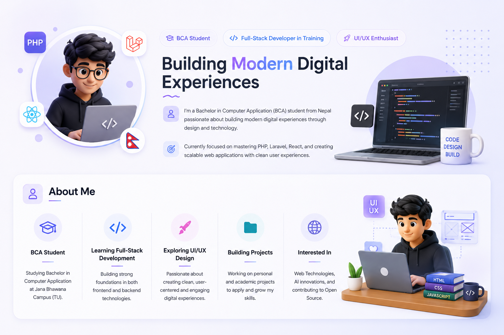

<div align="center">


<a href="https://git.io/typing-svg">
  
</a>

<br>


</div>

---

## About Me



I am **Nirmal Sanjel**, a Bachelor of Computer Application student from Nepal with a strong interest in web development, software engineering, and digital product design.

I enjoy transforming ideas into functional and visually refined digital experiences. My current work focuses on frontend development with React and TypeScript, backend development with PHP and Supabase, database design, responsive interfaces, and practical academic projects.

* BCA student at **Jana Bhawana Campus, Tribhuvan University**
* Building full-stack academic and personal projects
* Learning advanced React, TypeScript, PHP, and backend development
* Exploring UI/UX design and modern interface systems
* Interested in AI-assisted development and open-source software
* Focused on writing maintainable, secure, and scalable applications
* Based in **Lalitpur, Nepal**

<br clear="right"/>

---

## Current Focus

```typescript
const nirmal = {
  education: "Bachelor of Computer Application",
  college: "Jana Bhawana Campus",
  university: "Tribhuvan University",
  location: "Lalitpur, Nepal",

  currentlyLearning: [
    "Advanced React",
    "TypeScript",
    "PHP Backend Development",
    "REST API Design",
    "Database Architecture",
    "Software Engineering"
  ],

  interests: [
    "Full-Stack Development",
    "UI/UX Design",
    "Progressive Web Apps",
    "Artificial Intelligence",
    "Open Source"
  ],

  goal: "Build meaningful digital products with clean user experiences"
};
```

---

## Languages and Technologies

<div align="center">

### Frontend

<p>
  
</p>

### Backend and Databases

<p>
  
</p>

### Design and Development Tools

<p>
  
</p>

</div>

---

## What I Am Learning

| Area                 | Current Direction                                                     |
| -------------------- | --------------------------------------------------------------------- |
| Frontend Development | React architecture, TypeScript, reusable components, state management |
| Backend Development  | PHP, Node.js, REST APIs, authentication, server-side validation       |
| Database Engineering | MySQL, PostgreSQL, Supabase, relational database design               |
| UI/UX Design         | Responsive design, accessibility, glassmorphism, design systems       |
| Software Engineering | Clean code, Git workflows, testing, security, documentation           |
| Deployment           | Cloudflare Pages, Vite deployments, environment configuration         |

---

## Featured Projects

### JBC Athenaeum

A moderated academic resource archive for Jana Bhawana Campus students.

**Highlights:** React, TypeScript, Supabase, role-based access, secure PDF management, academic resources, moderation workflows, and responsive design.

### LostLink

A campus lost-and-found management platform built to help students report, discover, claim, and recover lost items.

**Highlights:** PHP, MySQL, authentication, claims, admin review, reward points, email notifications, and item management.

### Naam Japa Tracker

An offline spiritual practice tracker focused on daily Naam Japa counting and mindful consistency.

**Highlights:** Android development, Kotlin, Jetpack Compose, offline storage, reminders, themes, and progress tracking.

### Personal Portfolio

A modern portfolio website showcasing projects, skills, creative experiments, and professional growth.

**Highlights:** React, TypeScript, Tailwind CSS, Framer Motion, GSAP, responsive layouts, and cinematic interactions.

---

## GitHub Analytics

<div align="center">


<br>


</div>

---

## Contribution Activity

<div align="center">


</div>

---

## Developer Journey

```text
Learning fundamentals
        ↓
Building academic projects
        ↓
Designing better user experiences
        ↓
Developing complete applications
        ↓
Improving security and scalability
        ↓
Contributing to meaningful software
```

---

## Development Philosophy

> Design is not only how a product looks.
> It is how clearly, reliably, and meaningfully it works.

I believe strong software combines:

* Clear problem-solving
* Thoughtful user experience
* Maintainable source code
* Secure backend architecture
* Continuous learning
* Meaningful real-world value

---

## Connect With Me

<div align="center">

<a href="https://www.linkedin.com/in/nirmalsanjel/" target="_blank">
  
</a>

<a href="mailto:hackingwithnirmal@gmail.com">
  
</a>

<a href="https://nirmalsanjel.com.np" target="_blank">
  
</a>

<a href="https://github.com/SanjelNirmal" target="_blank">
  
</a>

</div>

---

<div align="center">

### Building, learning, and improving—one project at a time.


<br>

**© 2026 Nirmal Sanjel**

<br>


</div>
