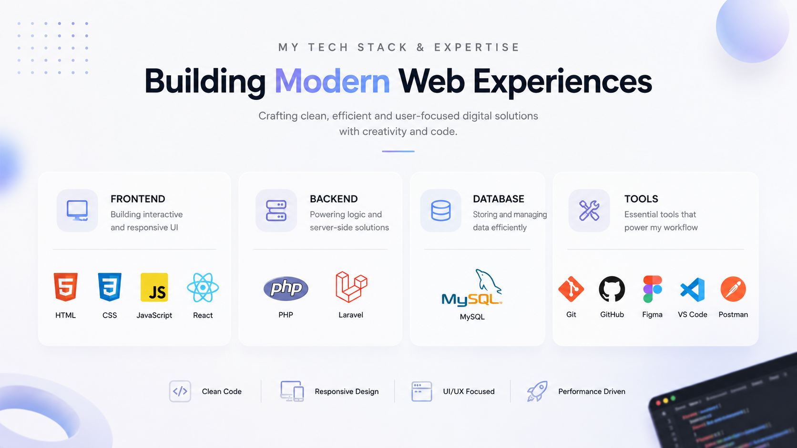

### Hi there 👋 I'm Nirmal Sanjel

**BCA Student • Full-Stack Developer in Training • UI/UX Enthusiast**
 
  
I'm a Bachelor in Computer Application (BCA) student from Nepal passionate about building modern digital experiences through design and technology. Currently focused on mastering PHP, Laravel, React, and creating scalable web applications with clean user experiences.

---

### 👨‍💻 About Me

- 🎓 **BCA Student** at Jana Bhawana Campus (TU)
- 💻 **Learning** Full-Stack Development
- 🎨 **Exploring** UI/UX Design & Digital Product Design
- 🚀 **Building** personal and academic projects
- 🤖 **Interested in** Web Technologies, AI, and Open Source
- 🌱 **Currently mastering** PHP, Laravel, and React

---

### 🛠️ Languages and Tools
 

  
  
  
  
  
  
  
  
  
  
  
  

---

### 🎯 Current Focus & Learning Path

*   **Development:** Advanced React, Laravel Ecosystem, REST APIs, and scalable backend development.
*   **Design:** Improving UI/UX design skills, specifically focusing on modern aesthetics like glassmorphism and clean digital product design.
*   **Engineering:** Strengthening problem-solving skills, database design, and core software engineering practices.

---

### 📊 GitHub Statistics

  

  

---

**2026 Nirmal Sanjel❤️!**

  <i>"Design is not just what it looks like and feels like. Design is how it works."</i>

 

  
  
  

